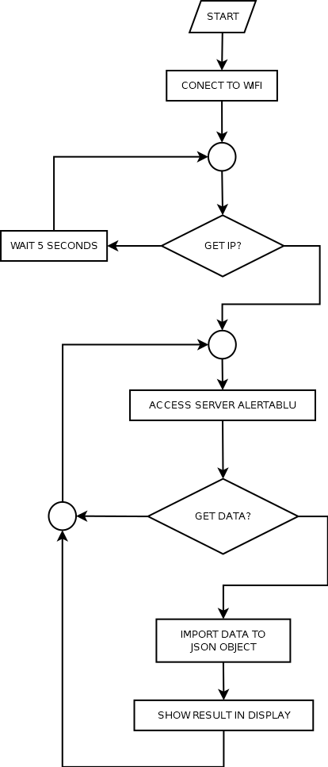

# AlertaBlu
Get information in website http://alertablu.cob.sc.gov.br/p/detalhada about situation of weather and print using Node MCU 8266 and Nextion NX3224T024

This site show informations aboute situation of weather in Blumenau, very important to make actions by people.

This project use PHP (http://php.net/) to get information in web page, NodeMCU ESP8266 (https://nodemcu.readthedocs.io/en/master/) to connect to server of the host PHP and get information simple to show in Nextion NX3224T024 (https://nextion.tech/basic-series-introduction/).

1 - This project is show in Figure below:



2 - File "[data.php](./data.php)" to get informations about web page http://alertablu.cob.sc.gov.br/p/detalhada
```
<?php
	Use:
		// data.php?option=date
		// data.php?option=period
		// data.php?option=condition
		// data.php?option=sky
		// data.php?option=precipitation
		// data.php?option=wind
		// data.php?option=temperature
		// data.php?option=temperaturedate
		// data.php?option=temperaturemininum
		// data.php?option=temperaturemaximum
		// data.php?option=temperaturaunit
		// data.php?option=basic
		// data.php?option=all
		// data.php?option=node
	
	header( 'Content-Type: application/json' );
	error_reporting(~E_ALL);
	
	function getPeriod( $xpath, $padrao ){
		$value =[];
		for( $i=0; $i<4; $i++ ){
			preg_match( $padrao, $xpath->query( '//table [@id="forecast-table"]/thead/tr/th' )->item($i)->textContent, $matches, PREG_OFFSET_CAPTURE);
			$value[$i] = str_replace("ã", "a", $matches[0][0]);
		}
		return $value;
	}
	
	function figureToNumber( $name ){
		$figures = [
			'D/claro.png',
			'D/encoberto.png',
			'D/encoberto_chuva.png',
			'D/encoberto_nublado_chuva.png',
			'D/nublado.png',
			'D/nublado_chuva.png',
			'D/parcial_nublado.png',
			'N/claro.png',
			'N/encoberto.png',
			'N/encoberto_chuva.png',
			'N/encoberto_nublado_chuva.png',
			'N/nublado.png',
			'N/nublado_chuva.png',
			'N/parcial_nublado.png'
		];
		
		$index = array_search( $name, $figures );
		return ($index===FALSE?14:$index);
	}
	
	function getImages( $xpath, $index ){
		$node = $xpath->query( '//table [@id="forecast-table"]/tbody/tr' )->item($index);
		$child = $node->firstChild;
		$i = 0;
		$value = [];
		while( $child ){
			if( $child->nodeName == 'td' ){
				$value[$i] = substr( $child->childNodes[1]->getAttribute( 'src' ), 21 );
				$i = $i + 1;
			}
			$child = $child->nextSibling;
		}
		return $value;
	}
	
	function getOthers( $xpath, $index ){
		$node = $xpath->query( '//table [@id="forecast-table"]/tbody/tr' )->item($index);
		$child = $node->firstChild;
		$i = 0;
		$value = [];
		while( $child ){
			if( $child->nodeName == 'td' ){
				$value[$i] = str_replace( "ã", "a", $child->textContent);
				$value[$i] = str_replace( "á", "a", $value[$i]);
				$value[$i] = str_replace( "é", "e", $value[$i]);
				$value[$i] = str_replace( "ç", "c", $value[$i]);
				$i = $i + 1;
			}
			$child = $child->nextSibling;
		}
		return $value;
	}
	
	function getTemperature( $xpath, $index ){
		$node = $xpath->query( '//table [@id="forecast-table"]/tbody/tr' )->item($index);
		$child = $node->firstChild;
		$value = [];
		while( $child ){
			if( $child->nodeName == 'td' ){
				$text = trim( $child->firstChild->textContent );
				preg_match_all( '/\d+/', $text, $matches, PREG_OFFSET_CAPTURE );
				$value[0] = $matches[0][0][0];
				$value[1] = $matches[0][1][0];
				$value[2] = $matches[0][2][0];
				$value[3] = $matches[0][3][0];
				$value[4] = $matches[0][4][0];
				break;
			}
			$child = $child->nextSibling;
		}
		return $value;
	}
	
	function getJSON( $data, $field ){ 
		$result = '"' . $field . '":[';
		foreach( $data[$field] as $key => $value ){
			$result = $result . "\"$value\",";
		}
		$result = substr( $result, 0, strlen($result)-1 );
		$result = $result . ']';
		return $result;
	}
	
	function help(){
		return
			"\r\n\t" . 'help": "use data.php?option=op",' . "\r\n\t" .
			'"op": "date, period, condition, sky, precipitation, wind, temperature, temperaturedate, temperaturemininum, temperaturemaximum, temperaturaunit, basic, all or node"' . "\r\n";
	}
	
	$filename = 'http://alertablu.cob.sc.gov.br/p/detalhada'; // string //
	$flags = FILE_BINARY; // int //
	$context = NULL; // resource //
	$offset = 0; // int //
	$maxlen = 100000; // int //
	if( ($text = file_get_contents($filename, $flags, $context, $offset, $maxlen)) !== FALSE ){
		$doc = new DOMDocument;
		$doc->loadHTML( $text );
		$xpath = new DOMXpath( $doc );
		$data = [];
		
		$data['data']                    = getPeriod( $xpath, '@[0-9]{2}/[0-9]{2}/[0-9]{4}@i' );
		$data['periodo_do_dia']          = getPeriod( $xpath, '@[a-zA-Z].*@i' );
		$data['condicao_do_tempo_img']   = getImages( $xpath, 0 );
		$data['ceu']                     = getOthers( $xpath, 1 );
		$data['precipitacao']            = getOthers( $xpath, 2 );
		$data['vento']                   = getOthers( $xpath, 3 );
		$data['temperatura']             = getOthers( $xpath, 4 );
		$values                          = getTemperature( $xpath, 5 );
		$data['temperatura_data']        = $values[0].'/'.$values[1].'/'.$values[2];
		$data['temperatura_minima']      = $values[3];
		$data['temperatura_maxima']      = $values[4];
		$data['temperatura_unidade']     = 'C';
		
		$result = '{';
		if( isset($_GET['option']) ){
			switch( $_GET['option'] ){
				case 'date':
					$result = $result . getJSON( $data, 'data' );
					break;
				case 'period':
					$result = $result . getJSON( $data, 'periodo_do_dia' );
					break;
				case 'condition':
					$result = $result . getJSON( $data, 'condicao_do_tempo_img' );
					break;
				case 'sky':
					$result = $result . getJSON( $data, 'ceu' );
					break;
				case 'precipitation':
					$result = $result . getJSON( $data, 'precipitacao' );
					break;
				case 'wind':
					$result = $result . getJSON( $data, 'vento' );
					break;
				case 'temperature':
					$result = $result . getJSON( $data, 'temperatura' );
					break;
				case 'temperaturedate':
					$result = $result . "\"temperatura_data\":\"{$data['temperatura_data']}\"";
					break;
				case 'temperaturemininum':
					$result = $result . "\"temperatura_minima\":\"{$data['temperatura_minima']}\"";
					break;
				case 'temperaturemaximum':
					$result = $result . "\"temperatura_maxima\":\"{$data['temperatura_maxima']}\"";
					break;
				case 'temperaturaunit':
					$result = $result . "\"temperatura_unidade\":\"{$data['temperatura_unidade']}\"";
					break;
				case 'basic':
					$result = $result . getJSON( $data, 'data' ) . ',';
					$result = $result . getJSON( $data, 'periodo_do_dia' ) . ',';
					$result = $result . getJSON( $data, 'condicao_do_tempo_img' ) . ',';
					$result = $result . "\"temperatura_minima\":\"{$data['temperatura_minima']}\"" . ',';
					$result = $result . "\"temperatura_maxima\":\"{$data['temperatura_maxima']}\"";
					break;
				case 'all':
					$result = $result . getJSON( $data, 'data' ) . ',';
					$result = $result . getJSON( $data, 'periodo_do_dia' ) . ',';
					$result = $result . getJSON( $data, 'condicao_do_tempo_img' ) . ',';
					$result = $result . getJSON( $data, 'ceu' ) . ',';
					$result = $result . getJSON( $data, 'precipitacao' ) . ',';
					$result = $result . getJSON( $data, 'vento' ) . ',';
					$result = $result . getJSON( $data, 'temperatura' ) . ',';
					$result = $result . "\"temperatura_data\":\"{$data['temperatura_data']}\"" . ',';
					$result = $result . "\"temperatura_minima\":\"{$data['temperatura_minima']}\"" . ',';
					$result = $result . "\"temperatura_maxima\":\"{$data['temperatura_maxima']}\"" . ',';
					$result = $result . "\"temperatura_unidade\":\"{$data['temperatura_unidade']}\"";
					break;
				case 'node':
					$result = $result . str_ireplace( 'data', 'd', getJSON( $data, 'data' ) ) . ',';
					$result = $result . str_ireplace( 'periodo_do_dia', 'p', getJSON( $data, 'periodo_do_dia' ) ) . ',';
					$result = $result . '"i":[';
					$result = $result . '"' . figureToNumber($data['condicao_do_tempo_img'][0]) . '",';
					$result = $result . '"' . figureToNumber($data['condicao_do_tempo_img'][1]) . '",';
					$result = $result . '"' . figureToNumber($data['condicao_do_tempo_img'][2]) . '",';
					$result = $result . '"' . figureToNumber($data['condicao_do_tempo_img'][3]) . '"],';
					$result = $result . "\"l\":\"{$data['temperatura_minima']}\"" . ',';
					$result = $result . "\"u\":\"{$data['temperatura_maxima']}\"" . ',';
					$result = $result . '"h":"' . date('H:i') . '"';
					break;
				default:
					$result = $result . help();
					break;
			}
		}
		else{
			$result = $result . help();
		}
		$result = $result . '}';
		echo $result;
	}
	else{
		echo '{"error":"error to open page"}';
	}
?>
```

3 - File "[connection_nextion.lua](./connection_nextion.lua)" to execute in NodeMCU ESP8266.
The modules installed in NodeMCU are ([http://nodemcu-build.com/](https://nodemcu-build.com/)):
* file
* gpio
* http
* i2c
* mqtt
* net
* node
* ow
* pwm
* sjson
* spi
* tmr
* uart
* wifi

```
-- 1 to use D4 (GPIO4) --
function writeNextion(command)
	uart.setup(1,9600,8,uart.PARITY_NONE,uart.STOPBITS_1,1)
	uart.write(1,command)
	for i=1,3 do
		uart.write(1,0xff)
	end
end

function connetion()
	http.get('http://www.everton.mat.br/alertablu/data.php?option=node',nill,function(code,data)
		if code<0 then
			print("HTTP request failed\n")
		else
			print(code,data)
			decoder=sjson.decoder()
			decoder:write(data)
			result = decoder:result()
			print('          Data[0]: '..result['d'][1])
			print('Periodo do dia[0]: '..result['p'][1])
			print('        Imagem[0]: '..result['i'][1])
			print(' Temperatura min.: '..result['l'])
			print(' Temperatura max.: '..result['u'])
			
			writeNextion('t0.txt="'..result['p'][1]..'"')
			writeNextion('t2.txt="'..result['p'][2]..'"')
			writeNextion('t4.txt="'..result['p'][3]..'"')
			writeNextion('t6.txt="'..result['p'][4]..'"')
			
			writeNextion('t1.txt="'..result['d'][1]..'"')
			writeNextion('t3.txt="'..result['d'][2]..'"')
			writeNextion('t5.txt="'..result['d'][3]..'"')
			writeNextion('t7.txt="'..result['d'][4]..'"')
			
			writeNextion('p0.pic='..result['i'][1])
			writeNextion('p1.pic='..result['i'][2])
			writeNextion('p2.pic='..result['i'][3])
			writeNextion('p3.pic='..result['i'][4])
			
			writeNextion('t10.txt="'..result['l']..'"')
			writeNextion('t11.txt="'..result['u']..'"')
			
			writeNextion('t12.txt="'..result['h']..'"')
		end
	end)
end

wifi.setmode(wifi.STATION)
station_cfg={}
station_cfg.ssid="Virus..."
station_cfg.pwd="victoriaHelena"
wifi.sta.config(station_cfg)

mytimer1=tmr.create()
mytimer1:register(5000,tmr.ALARM_AUTO,function(t1)
	if wifi.sta.getip()~=nil then
		print(wifi.sta.getip())
		t1:unregister()
	else
		print("without ip\n")
	end
end)
mytimer1:start()

connetion()

mytimer2=tmr.create()
mytimer2:register(60000,tmr.ALARM_AUTO,function(t2)
	connetion()
end)
mytimer2:start()
```

4 - Here have images of execution

|                                                                               |                                                       |
| ----------------------------------------------------------------------------- | ----------------------------------------------------- |
| [](./IMG_20200117_124123.jpg) | [](./print_1.png) |
| [](./IMG_20200117_173616.jpg) | [](./print_2.png) |
| [](./IMG_20200117_173741.jpg) | [](./print_3.png) |